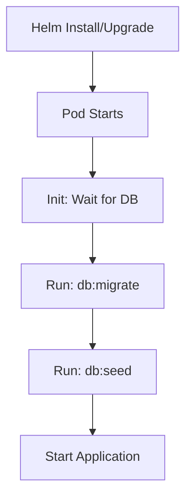
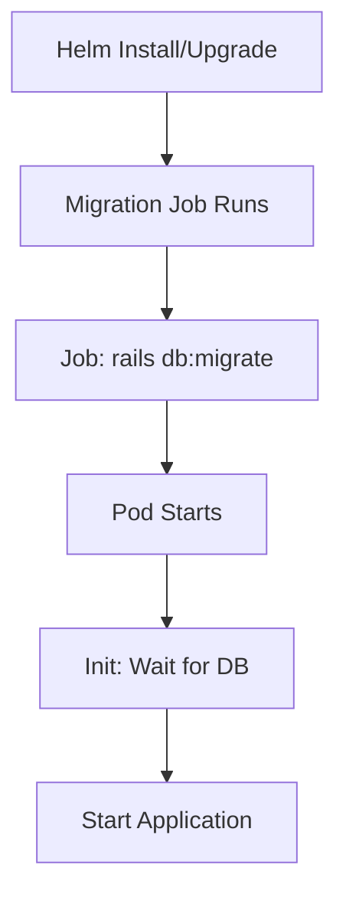

## Overview

Heimdall automatically runs database migrations on every container startup. This approach follows Node.js/Sequelize patterns and requires no manual intervention.

## Migration Strategy

### Automatic Migrations on Startup

Unlike some applications that require separate migration jobs, Heimdall's architecture includes migrations as part of the application startup sequence.

**Container Startup Flow** (defined in `cmd.sh`):

```bash
#!/bin/sh
set -e
yarn backend sequelize-cli db:migrate   # 1. Run migrations
yarn backend sequelize-cli db:seed:all  # 2. Seed database
yarn backend start                      # 3. Start application
```

This means:
- ✅ Every pod automatically runs migrations when it starts
- ✅ No separate Helm hooks or Jobs required
- ✅ Works identically in Docker, Docker Compose, and Kubernetes
- ✅ Migrations run before the application accepts traffic

### Idempotency and Safety

Sequelize provides built-in protection against duplicate migrations:

1. **Migration Tracking**: Sequelize maintains a `SequelizeMeta` table that records which migrations have been applied
2. **Idempotent Execution**: Running `db:migrate` multiple times is safe - only unapplied migrations execute
3. **Concurrent Safety**: Sequelize uses database locks to prevent race conditions when multiple pods start simultaneously

## Kubernetes Deployment

### Single Replica Deployment

When running with `replicas: 1` (the default):

```yaml
heimdall:
  replicaCount: 1
```

1. Pod starts
2. Init container waits for PostgreSQL (`pg_isready`)
3. Main container runs migrations
4. Application becomes ready

### Multiple Replica Deployment (HA Mode)

When scaling to multiple replicas for high availability:

```yaml
heimdall:
  replicaCount: 3
```

**What happens**:
- All pods may start simultaneously
- Each pod runs `db:migrate` on startup
- Sequelize's locking mechanism ensures only one pod actually applies new migrations
- Other pods see migrations already applied and skip them

**This is safe and expected behavior.**

## Database Permissions

### Embedded PostgreSQL (Default)

When using the chart's embedded PostgreSQL (via Bitnami subchart):

```yaml
postgresql:
  enabled: true  # Default
```

The `postgres` user has full DDL permissions. No configuration needed.

### External Database (Production)

When using an external PostgreSQL instance (RDS, Cloud SQL, Azure Database):

```yaml
postgresql:
  enabled: false
externalDatabase:
  host: db.example.com
  database: heimdall_production
  username: heimdall_app
```

**Required Permissions**:

The database user must have DDL permissions to create, alter, and drop tables:

```sql
-- Example: Grant migration permissions
GRANT CREATE, ALTER, DROP ON DATABASE heimdall_production TO heimdall_app;
GRANT ALL PRIVILEGES ON ALL TABLES IN SCHEMA public TO heimdall_app;
GRANT ALL PRIVILEGES ON ALL SEQUENCES IN SCHEMA public TO heimdall_app;
```

::callout{icon="i-heroicons-exclamation-triangle" color="amber"}
**Important**: If your database user has read-only permissions, migrations will fail on startup and the pod will crash.
::

## Troubleshooting

### Pod Crashes with Migration Errors

**Symptom**: Pod stuck in `CrashLoopBackOff`, logs show migration failures

**Common Causes**:

1. **Database not ready**: Init container should prevent this, but network issues can occur
   ```bash
   # Check init container logs
   kubectl logs -n heimdall <pod-name> -c wait-for-postgres
   ```

2. **Insufficient permissions**: External database user lacks DDL permissions
   ```bash
   # Check migration error details
   kubectl logs -n heimdall <pod-name> | grep "db:migrate"
   ```

3. **Network connectivity**: Pod can't reach database host
   ```bash
   # Test connectivity from pod
   kubectl exec -n heimdall <pod-name> -- pg_isready -h <db-host> -p 5432
   ```

**Solution**: Fix the underlying issue (database access, credentials, networking) and the pod will auto-restart with migrations.

### Migrations Take Too Long

**Symptom**: Pods take several minutes to become Ready

**Causes**:
- Large database with many existing rows
- Complex migrations (adding indexes to millions of rows)
- Slow database performance

**Solutions**:

1. **Increase startup probe timeout**:
   ```yaml
   heimdall:
     startupProbe:
       initialDelaySeconds: 60  # Increase from default
       periodSeconds: 10
       failureThreshold: 30     # Allow 5 minutes for startup
   ```

2. **Run migrations manually before deployment** (advanced):
   ```bash
   # Create a temporary migration pod
   kubectl run heimdall-migrate -n heimdall \
     --image=mitre/heimdall2:release-latest \
     --restart=Never \
     --env="DATABASE_HOST=heimdall-postgresql" \
     --env="DATABASE_PASSWORD=<password>" \
     --command -- yarn backend sequelize-cli db:migrate

   # Wait for completion
   kubectl wait --for=condition=complete -n heimdall job/heimdall-migrate

   # Deploy application (migrations already applied)
   helm upgrade heimdall ./heimdall -n heimdall
   ```

### Rolling Update Behavior

**Question**: What happens during a Helm upgrade when pods restart?

**Answer**:

With StatefulSet (default):
1. Helm triggers upgrade
2. Pod 0 terminates gracefully
3. New Pod 0 starts:
   - Init container waits for database
   - Container runs `db:migrate` (applies any new migrations)
   - Application starts
4. Process repeats for Pod 1, Pod 2, etc.

This ensures:
- ✅ Migrations run before new application code starts
- ✅ Only one pod runs migrations at a time (StatefulSet sequential updates)
- ✅ Sequelize prevents duplicate migration execution

## Design Decision Rationale

### Why No Separate Migration Job?

The Heimdall Helm chart **does not use a separate Helm hook Job** for migrations, unlike some other charts (e.g., GitLab, Vulcan). This decision is intentional and based on:

1. **Application Architecture**: Heimdall's container entrypoint (`cmd.sh`) already includes migrations by design
2. **Ecosystem Consistency**: Other Node.js/Sequelize applications (Ghost, Directus, Strapi) use the same pattern
3. **Simplicity**: No extra Kubernetes objects (Jobs, ServiceAccounts, hook management)
4. **Idempotency**: Sequelize's migration tracking makes multiple executions safe
5. **Developer Experience**: Works identically in development (Docker Compose) and production (Kubernetes)

### When Would a Separate Job Make Sense?

Separate migration jobs (Helm hooks) are beneficial when:

- ❌ **Application does NOT run migrations on startup** (e.g., Rails apps where `rails server` just starts the server)
- ❌ **Strict ordering required** (e.g., backup → migrate → deploy with hook weights)
- ❌ **Manual approval needed** (e.g., review migration SQL before applying)

None of these apply to Heimdall's architecture.

## Comparison with Other Patterns

### Heimdall (Application-Managed)



**Pros**: Simple, consistent, self-healing
**Cons**: No explicit migration approval step

### Vulcan (Separate Job)



**Pros**: Explicit migration step, easier to troubleshoot separately
**Cons**: More complex (Job + hooks), requires careful ordering

## References

- [Heimdall Source Code](https://github.com/mitre/heimdall2) - See `cmd.sh` for startup sequence
- [Sequelize Migrations](https://sequelize.org/docs/v6/other-topics/migrations/) - Official Sequelize documentation
- [MIGRATION-JOB-RESEARCH.md](../../../MIGRATION-JOB-RESEARCH.md) - Detailed research on migration strategies

## Summary

::card-group
  ::card{title="✅ Migrations are Automatic" icon="i-heroicons-check-circle"}
  Heimdall runs migrations on every container startup. No manual steps required.
  ::

  ::card{title="✅ Safe for Multiple Replicas" icon="i-heroicons-shield-check"}
  Sequelize's idempotency and locking ensure concurrent startups don't cause issues.
  ::

  ::card{title="✅ Works Everywhere" icon="i-heroicons-globe-alt"}
  Identical behavior in Docker, Docker Compose, and Kubernetes deployments.
  ::

  ::card{title="✅ Self-Healing" icon="i-heroicons-arrow-path"}
  If a migration fails, fix the database issue and the pod auto-restarts with migrations.
  ::
::
