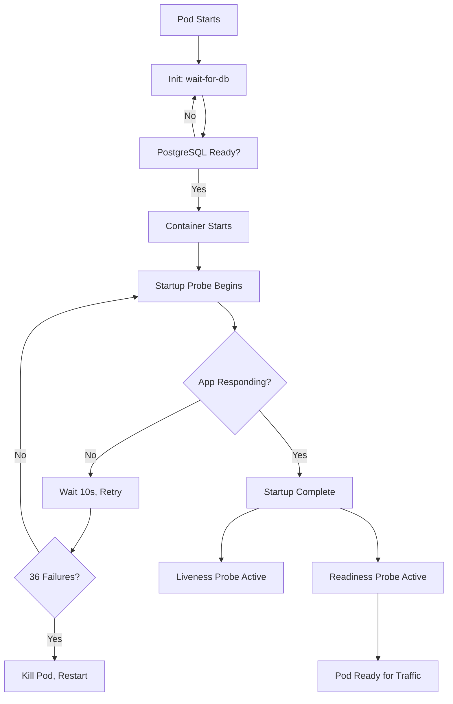

## Overview

Heimdall supports Kubernetes health probes and high availability features to ensure reliable deployments:

- **Startup Probe** - Handles slow initial startup (database migrations)
- **Liveness Probe** - Detects if application is stuck/deadlocked
- **Readiness Probe** - Determines if pod can receive traffic
- **PodDisruptionBudget (PDB)** - Prevents disruptions during node maintenance
- **HorizontalPodAutoscaler (HPA)** - Auto-scales based on CPU/memory

## Health Probes

### Default Configuration

The chart includes optimized health probe settings that work well for most deployments:

```yaml
heimdall:
  startupProbe:
    enabled: true
    httpGet:
      path: /
      port: 3000
    initialDelaySeconds: 10
    periodSeconds: 10
    timeoutSeconds: 5
    failureThreshold: 36  # 6 minutes max startup time

  livenessProbe:
    httpGet:
      path: /
      port: 3000
    initialDelaySeconds: 0  # Startup probe handles this
    periodSeconds: 10
    timeoutSeconds: 5
    failureThreshold: 3

  readinessProbe:
    httpGet:
      path: /
      port: 3000
    initialDelaySeconds: 0  # Startup probe handles this
    periodSeconds: 10
    timeoutSeconds: 5
    failureThreshold: 3
```

### Why Three Probes?

**Startup Probe** (handles first boot):
- Critical for Heimdall because it runs Sequelize migrations on startup
- Migrations can take several minutes on first deploy or after upgrades
- Prevents Kubernetes from killing the pod during migrations
- Allows up to 6 minutes for startup (36 failures × 10s period)

**Liveness Probe** (detects crashes):
- Checks if application is responsive
- Restarts pod if it becomes stuck or deadlocked
- Uses root path `/` since Heimdall lacks dedicated health endpoints

**Readiness Probe** (controls traffic):
- Determines if pod can handle requests
- Removes pod from service endpoints if unhealthy
- Prevents traffic to pods that aren't ready

::callout{icon="i-heroicons-information-circle" color="blue"}
**Note**: Heimdall currently doesn't have dedicated health check endpoints. The chart uses the root path `/` which returns HTTP 200 when the application is running. See [Future Improvements](#future-improvements) for planned enhancements.
::

### Probe Flow During Deployment



### Database Initialization

Before Heimdall starts, an init container waits for PostgreSQL:

```yaml
initContainers:
  - name: wait-for-db
    image: postgres:16-alpine
    command:
      - sh
      - -c
      - |
        until pg_isready -h {{ db-host }} -p {{ db-port }} -U {{ db-user }}; do
          echo "Waiting for PostgreSQL..."
          sleep 5
        done
```

This prevents application startup failures due to database unavailability.

## Tuning for Different Scenarios

### Fast Startup (Small Database, Few Migrations)

If your deployment has minimal migrations:

```yaml
heimdall:
  startupProbe:
    enabled: true
    initialDelaySeconds: 5
    periodSeconds: 5
    failureThreshold: 20  # 1.7 minutes max (20 × 5s)
```

### Slow Startup (Large Database, Many Migrations)

For deployments with extensive migrations:

```yaml
heimdall:
  startupProbe:
    enabled: true
    initialDelaySeconds: 30
    periodSeconds: 15
    failureThreshold: 40  # 10 minutes max (40 × 15s)
```

### High Traffic (Aggressive Checks)

For production with heavy load:

```yaml
heimdall:
  livenessProbe:
    periodSeconds: 5  # Check every 5s instead of 10s
    failureThreshold: 2  # Restart faster

  readinessProbe:
    periodSeconds: 3  # Check every 3s
    failureThreshold: 2  # Remove from service faster
```

### Resource-Constrained (Lenient Checks)

For limited resources or shared clusters:

```yaml
heimdall:
  livenessProbe:
    periodSeconds: 20  # Less frequent checks
    timeoutSeconds: 10  # Longer timeout
    failureThreshold: 5  # More tolerant

  readinessProbe:
    periodSeconds: 15
    timeoutSeconds: 10
    failureThreshold: 4
```

## High Availability

### PodDisruptionBudget (PDB)

PDB ensures availability during voluntary disruptions (node drains, cluster upgrades, scaling down).

::callout{icon="i-heroicons-exclamation-triangle" color="amber"}
**Important**: PDB only works with multiple replicas. Single-replica deployments cannot benefit from PDB.
::

**Enable PDB** (requires 2+ replicas):

```yaml
heimdall:
  podDisruptionBudget:
    enabled: true
    minAvailable: 1  # At least 1 pod must remain available
```

**Example Scenarios**:

- **Node Drain**: Kubernetes ensures 1 pod stays running while draining
- **Cluster Upgrade**: Rolling upgrade won't take down all pods at once
- **Scaling Down**: Prevents accidental removal of all pods

**Alternative Configuration** (maxUnavailable):

```yaml
heimdall:
  podDisruptionBudget:
    enabled: true
    maxUnavailable: 1  # Allow at most 1 pod to be unavailable
```

::callout{icon="i-heroicons-exclamation-circle" color="red"}
**Cannot use both**: Specify either `minAvailable` OR `maxUnavailable`, not both.
::

### HorizontalPodAutoscaler (HPA)

HPA automatically scales pods based on resource utilization.

**Prerequisites**:
- metrics-server installed in cluster
- Resource requests defined in values.yaml

**Enable HPA**:

```yaml
heimdall:
  autoscaling:
    enabled: true
    minReplicas: 2
    maxReplicas: 10
    targetCPUUtilizationPercentage: 70
    targetMemoryUtilizationPercentage: 80

  resources:
    requests:
      cpu: 500m
      memory: 512Mi
    limits:
      cpu: 2000m
      memory: 2Gi
```

**How HPA Works**:

1. metrics-server collects CPU/memory usage every 15s
2. HPA calculates: `desiredReplicas = ceil(currentReplicas × (currentUtilization / targetUtilization))`
3. If desiredReplicas differs from current, HPA scales up/down
4. Respects minReplicas and maxReplicas bounds

**Scaling Behavior**:

```yaml
heimdall:
  autoscaling:
    enabled: true
    minReplicas: 2
    maxReplicas: 10
    targetCPUUtilizationPercentage: 70

  # Example: CPU usage reaches 85%
  # desiredReplicas = ceil(2 × (85 / 70)) = ceil(2.43) = 3
  # HPA scales from 2 → 3 pods
```

**Advanced HPA** (custom metrics):

```yaml
# Not currently supported by chart, requires manual HPA configuration
# Future enhancement: support custom metrics via values
```

### Rolling Updates

The chart uses StatefulSet with RollingUpdate strategy for zero-downtime deployments.

**Default Configuration**:

```yaml
# Configured automatically in StatefulSet spec
updateStrategy:
  type: RollingUpdate
  rollingUpdate:
    partition: 0  # Update all pods
```

**How It Works**:

1. **Sequential Updates**: Pods update one at a time in reverse ordinal order (pod-2, pod-1, pod-0)
2. **Health Checks**: Each pod must pass readiness probe before next pod updates
3. **Automatic Rollback**: Failed updates stop automatically (pod remains unhealthy)

**Update Flow**:

```
Old Version:  pod-0 ✓  pod-1 ✓  pod-2 ✓
              ↓       ↓       ↓
Update:       pod-0 ✓  pod-1 ✓  pod-2 → updating → ready ✓
              ↓       ↓
Update:       pod-0 ✓  pod-1 → updating → ready ✓
              ↓
Update:       pod-0 → updating → ready ✓
```

**Partitioned Updates** (for canary deployments):

```yaml
# Update only pods with ordinal >= 2 (useful for testing)
updateStrategy:
  type: RollingUpdate
  rollingUpdate:
    partition: 2
```

::callout{icon="i-heroicons-information-circle" color="blue"}
**StatefulSet Updates**: Updates maintain pod identity and storage. Each pod retains its PVC across updates.
::

### Combining PDB and HPA

For production deployments, use both:

```yaml
heimdall:
  # Auto-scaling
  autoscaling:
    enabled: true
    minReplicas: 2
    maxReplicas: 10
    targetCPUUtilizationPercentage: 70

  # Disruption protection
  podDisruptionBudget:
    enabled: true
    minAvailable: 1

  # Resource requests (required for HPA)
  resources:
    requests:
      cpu: 500m
      memory: 512Mi
    limits:
      cpu: 2000m
      memory: 2Gi
```

**Behavior**:
- HPA scales between 2-10 pods based on load
- PDB ensures at least 1 pod always available during disruptions
- Even at min (2 pods), one can be disrupted while other handles traffic

## Verification

### Check Probe Status

**View probe configuration**:
```bash
kubectl describe pod -n heimdall heimdall-0 | grep -A 10 "Liveness:\|Readiness:\|Startup:"
```

**Check probe failures**:
```bash
kubectl get events -n heimdall --field-selector involvedObject.name=heimdall-0
```

### Monitor Startup

**Watch pod startup**:
```bash
kubectl get pods -n heimdall -w
```

**View startup probe logs**:
```bash
# Init container logs (database wait)
kubectl logs -n heimdall heimdall-0 -c wait-for-db

# Application logs
kubectl logs -n heimdall heimdall-0 -f
```

**Check startup time**:
```bash
kubectl get pod -n heimdall heimdall-0 -o jsonpath='{.status.conditions[?(@.type=="Ready")].lastTransitionTime}'
```

### Verify PDB

**Check PDB status**:
```bash
kubectl get pdb -n heimdall
```

Expected output:
```
NAME       MIN AVAILABLE   MAX UNAVAILABLE   ALLOWED DISRUPTIONS   AGE
heimdall   1               N/A               1                     5m
```

**Test PDB** (drain node):
```bash
# Drain node (PDB prevents disruption if only 1 pod)
kubectl drain <node-name> --ignore-daemonsets

# PDB blocks drain until another pod is ready
```

### Verify HPA

**Check HPA status**:
```bash
kubectl get hpa -n heimdall
```

Expected output:
```
NAME       REFERENCE             TARGETS   MINPODS   MAXPODS   REPLICAS   AGE
heimdall   StatefulSet/heimdall  45%/70%   2         10        2          5m
```

**Watch HPA scaling**:
```bash
kubectl get hpa -n heimdall -w
```

**Generate load** (test autoscaling):
```bash
# Port-forward to Heimdall
kubectl port-forward -n heimdall heimdall-0 3000:3000 &

# Generate load with Apache Bench
ab -n 10000 -c 100 http://localhost:3000/

# Watch HPA scale up
kubectl get hpa -n heimdall -w
```

## Troubleshooting

### Pod Stuck in Init

**Symptom**: Pod shows `Init:0/1` status

**Cause**: wait-for-db init container can't reach PostgreSQL

**Debug**:
```bash
kubectl logs -n heimdall heimdall-0 -c wait-for-db
```

**Common issues**:
- PostgreSQL not ready yet (wait longer)
- Wrong database host/port in values.yaml
- Network policy blocking connection
- PostgreSQL service doesn't exist

**Fix**:
```bash
# Check PostgreSQL pod
kubectl get pods -n heimdall | grep postgresql

# Check service
kubectl get svc -n heimdall | grep postgresql

# Verify connectivity
kubectl run -it --rm debug --image=postgres:16-alpine --restart=Never -- \
  pg_isready -h heimdall-postgresql -p 5432
```

### Startup Probe Failing

**Symptom**: Pod restarts repeatedly with `CrashLoopBackOff`

**Cause**: Startup takes longer than failureThreshold allows

**Check startup time**:
```bash
kubectl logs -n heimdall heimdall-0 | grep "Heimdall is now running"
```

**Fix**: Increase failureThreshold
```yaml
heimdall:
  startupProbe:
    failureThreshold: 60  # 10 minutes (60 × 10s)
```

### Liveness Probe Killing Healthy Pods

**Symptom**: Pods restart unexpectedly

**Cause**: Application temporarily slow (migrations, database queries)

**Check restart count**:
```bash
kubectl get pods -n heimdall
```

**Fix**: Increase timeoutSeconds or failureThreshold
```yaml
heimdall:
  livenessProbe:
    timeoutSeconds: 10  # Longer timeout
    failureThreshold: 5  # More tolerant
```

### HPA Not Scaling

**Symptom**: CPU > target but no scaling occurs

**Check metrics-server**:
```bash
kubectl top pods -n heimdall
```

If error: metrics-server not installed
```bash
kubectl apply -f https://github.com/kubernetes-sigs/metrics-server/releases/latest/download/components.yaml
```

**Check resource requests**:
```bash
kubectl describe pod -n heimdall heimdall-0 | grep -A 5 "Requests:"
```

HPA requires resource requests to calculate utilization percentage.

**Fix**: Add resource requests
```yaml
heimdall:
  resources:
    requests:
      cpu: 500m
      memory: 512Mi
```

### PDB Blocking Node Drain

**Symptom**: `kubectl drain` hangs with "Cannot evict pod"

**Cause**: Not enough healthy replicas to satisfy PDB

**Check**:
```bash
kubectl get pdb -n heimdall
# ALLOWED DISRUPTIONS: 0 means PDB is blocking
```

**Fix**: Scale up temporarily
```bash
# Increase replicas to allow disruption
helm upgrade heimdall ./heimdall -n heimdall \
  --set heimdall.replicaCount=3

# Wait for new pod to be ready
kubectl get pods -n heimdall -w

# Now drain will succeed (PDB allows 1 disruption)
kubectl drain <node-name> --ignore-daemonsets
```

## Best Practices

### Development

```yaml
heimdall:
  startupProbe:
    enabled: true
    failureThreshold: 20  # Lenient

  podDisruptionBudget:
    enabled: false  # Not needed for dev

  autoscaling:
    enabled: false  # Fixed replicas for dev
```

### Staging

```yaml
heimdall:
  startupProbe:
    enabled: true
    failureThreshold: 36  # Production-like

  podDisruptionBudget:
    enabled: true
    minAvailable: 1

  autoscaling:
    enabled: true
    minReplicas: 2
    maxReplicas: 5
```

### Production

```yaml
heimdall:
  startupProbe:
    enabled: true
    initialDelaySeconds: 10
    periodSeconds: 10
    failureThreshold: 36

  livenessProbe:
    periodSeconds: 10
    timeoutSeconds: 5
    failureThreshold: 3

  readinessProbe:
    periodSeconds: 10
    timeoutSeconds: 5
    failureThreshold: 3

  podDisruptionBudget:
    enabled: true
    minAvailable: 2  # Ensure 2 pods always available

  autoscaling:
    enabled: true
    minReplicas: 3  # Start with 3 for redundancy
    maxReplicas: 20  # Scale aggressively
    targetCPUUtilizationPercentage: 60  # Scale earlier

  resources:
    requests:
      cpu: 1000m
      memory: 1Gi
    limits:
      cpu: 4000m
      memory: 4Gi
```

## Future Improvements

### Dedicated Health Endpoints

The Heimdall application currently lacks dedicated health check endpoints. The community is working on adding:

- `/health/liveness` - Application running check
- `/health/readiness` - Application + database ready check
- `/health/startup` - Migrations complete check

This will enable more accurate health detection. Track progress:
- Upstream PR: [pending]
- Chart issue: heimdall-helm-xe1

### Advanced HPA Metrics

Future chart versions may support:

- Custom metrics (requests per second, queue depth)
- External metrics (cloud load balancer metrics)
- Multiple metrics (CPU AND memory)
- Scaling policies (faster scale-up, slower scale-down)

## See Also

- [Database Configuration](./3.database.md) - PostgreSQL setup
- [Performance Tuning](./12.performance.md) - Resource optimization
- [Troubleshooting Guide](../5.troubleshooting/common-issues.md) - Common problems
